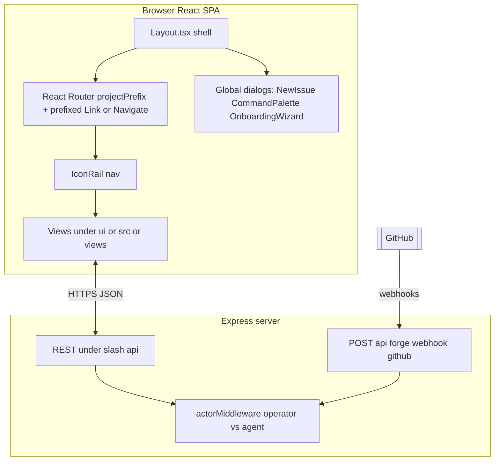
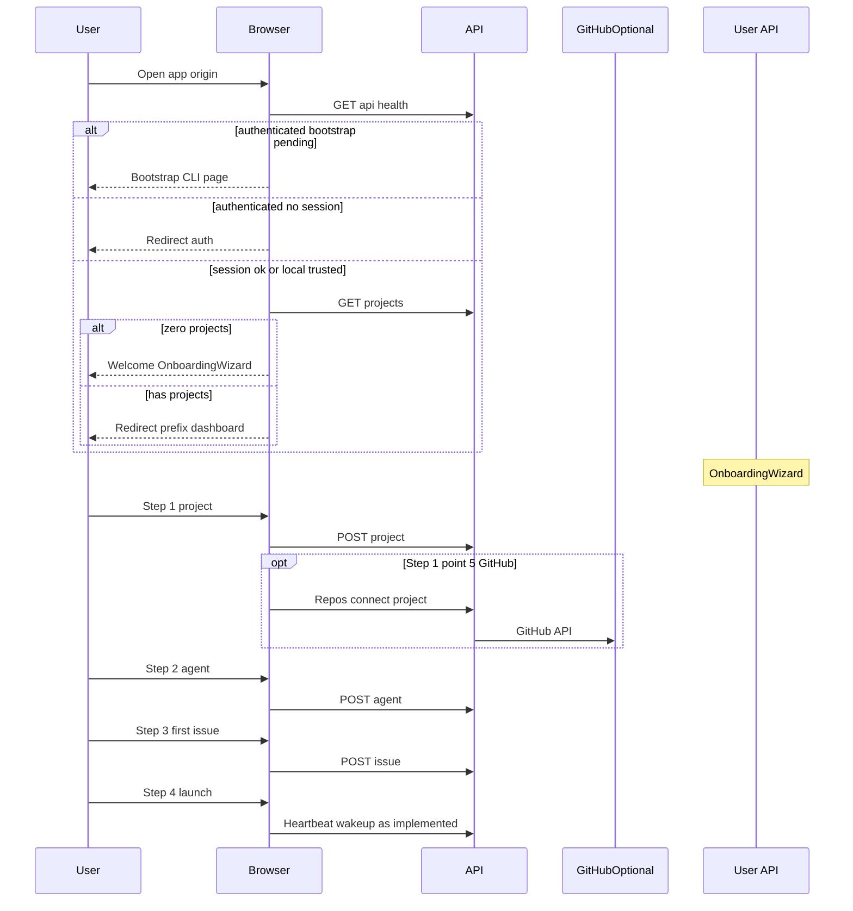
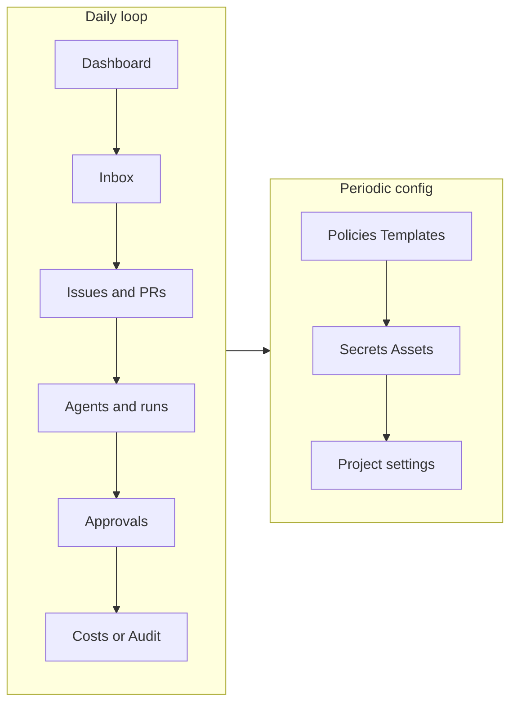

# GitMesh Operators Web UI Guide

This document describes the maintainer-facing **GitMesh Agents** web interface: navigation, routes, onboarding, day-to-day usage, and how the UI relates to the server. It reflects the **implemented** UI in `ui/` and API in `server/` as of the document’s authoring; where behavior is stubbed or incomplete, that is called out explicitly.

**Audience:** Human operators maintaining projects, agents, and governance—not authors of embedded agent adapters (see `doc/v1-spec.md` and adapter packages under `lib/adapters/`).

**Related docs:**

- [`doc/v1-spec.md`](v1-spec.md) — V1 product and data model contract  
- [`doc/DEVELOPING.md`](DEVELOPING.md) — Developer setup and commands  
- [`doc/DEPLOYMENT-MODES.md`](DEPLOYMENT-MODES.md) — `local_trusted`, `authenticated`, exposure  
- [`docs/guides/connecting-to-github.md`](../docs/guides/connecting-to-github.md) — Forge/GitHub connectivity (guide may be partial while the feature evolves)

---

## How the shell fits together

GitMesh exposes a single **SPA** at the HTTP origin (`http://localhost:3100` in dev). React Router renders views under [`ui/src/App.tsx`](../ui/src/App.tsx); the Express API mounts under `/api` in [`server/src/app.ts`](../server/src/app.ts).

### Project prefixes and URLs

Every **business** screen is scoped to one **GitMesh project**. URLs encode that project via a path prefix—the project’s **`issuePrefix`** field (shown in the header as uppercase, for example `GITAAA`):

- Pattern: `/{issuePrefix}/...` — e.g. `/GITAAA/dashboard`, `/GITAAA/issues`.
- Components use [`ProjectContext`](../ui/src/context/ProjectContext.tsx) (`selectedProjectId`) for API calls.
- Links and redirects use helpers in [`ui/src/lib/router.tsx`](../ui/src/lib/router.tsx) so paths stay prefix-correct.

If you browse without a prefix (for example `/issues`), [`UnprefixedBoardRedirect`](../ui/src/App.tsx) sends you to the same path under your **currently selected or first available** project’s prefix.

The **design guide** dev page is reachable at `/{prefix}/design-guide` (see routing in `App.tsx`).

---

## Authentication and startup gates

Before the board UI mounts, [`CloudAccessGate`](../ui/src/App.tsx) loads [`GET /api/health`](../server/src/api/health.ts) (via [`healthApi`](../ui/src/api/health.ts) in practice through query keys).

Rough behavior:

| Condition | What the user sees |
|-----------|---------------------|
| Health request fails | Error message; UI does not assume an operator session |
| `deploymentMode === "authenticated"` **and** `bootstrapStatus === "bootstrap_pending"` | **Bootstrap pending** page with CLI hint: `pnpm gitmesh-agents auth bootstrap-admin` |
| Authenticated mode **without** a valid session | Redirect to **`/auth`** with `next=` return path |
| `local_trusted` or valid session | **Outlet** renders; normal app routing continues |

Consult [`doc/DEPLOYMENT-MODES.md`](DEPLOYMENT-MODES.md) for authoritative definitions of modes and exposure.

---

## Navigation surfaces (desktop versus mobile)

### Desktop: Icon rail (“full sidebar”)

The collapsible-section sidebar is **`IconRail`** in [`ui/src/components/IconRail.tsx`](../ui/src/components/IconRail.tsx). It groups items as **Signal**, **Delivery**, **Automation**, **Configure**, and **Project**.

Badges use:

- [`sidebarBadgesApi`](../ui/src/api/sidebarBadges.ts) — inbox and approval counts, failed runs, etc.
- [`heartbeatsApi.liveRunsForProject`](../ui/src/api/heartbeats.ts) — **live run** count (polled every 10s).

### Mobile: drawer and bottom tabs

On small viewports [`Sidebar.tsx`](../ui/src/components/Sidebar.tsx) exposes a **reduced** set: Dashboard, Issues, Agents, Inbox, optional Approvals, Settings—not the full Deliver/Configure taxonomy.

[`MobileBottomNav.tsx`](../ui/src/components/MobileBottomNav.tsx) pins **Home**, **Issues**, **Agents**, **Inbox**, plus a floating **New Issue** button.

Keyboard shortcuts behave the same where applicable (unless focus is inside an input).

---

## Left rail: section-by-section reference

Chrome at the top of the rail:

- **GitMesh Control Plane** — branding only  
- [**ProjectSwitcher**](../ui/src/components/ProjectSwitcher.tsx) — switch active project (synced with URL prefix in [`Layout.tsx`](../ui/src/components/Layout.tsx))  
- **New Issue** — opens modal; **`C`** keyboard shortcut from [`useKeyboardShortcuts`](../ui/src/hooks/useKeyboardShortcuts.ts)

### Signal

| Item | Route (under `/{prefix}`) | Primary UI | Purpose |
|------|---------------------------|-------------|---------|
| Dashboard | `/dashboard` | [`Dashboard.tsx`](../ui/src/views/board/Dashboard.tsx) | Summary metrics, forge panel, agents panel, charts, recent activity/tasks |
| Inbox | `/inbox/new`, `/inbox/all` | [`Inbox.tsx`](../ui/src/views/board/Inbox.tsx) | Triage: approvals, failed runs, join requests, stale work, dismissed items (`localStorage`) |
| Approvals | `/approvals/pending`, `/approvals/all`, `/approvals/:id` | [`Approvals.tsx`](../ui/src/views/general/Approvals.tsx), [`ApprovalDetail.tsx`](../ui/src/views/general/ApprovalDetail.tsx) | Queue for **`require_approval`** policy outcomes |

### Delivery

| Item | Route | Primary UI | Purpose |
|------|-------|-------------|---------|
| Issues | `/issues`, `/issues/:issueId` | [`Issues.tsx`](../ui/src/views/board/Issues.tsx), [`IssueDetail.tsx`](../ui/src/views/board/IssueDetail.tsx) | Tasks/work units; comments; assignee; ties to forge when linked |
| Pull Requests | `/prs`, `/prs/:prId` | [`PRs.tsx`](../ui/src/views/board/PRs.tsx), [`PRDetail.tsx`](../ui/src/views/board/PRDetail.tsx) | PR records synced or created in GitMesh [`pull-requests` API](../server/src/api/pull-requests.js) |
| Milestones | `/milestones`, `/milestones/:milestoneId` | [`Milestones.tsx`](../ui/src/views/board/Milestones.tsx), [`MilestoneDetail.tsx`](../ui/src/views/board/MilestoneDetail.tsx) | Group issues by milestone |
| Subprojects | `/subprojects`, nested | [`Subprojects.tsx`](../ui/src/views/board/Subprojects.tsx), [`SubprojectDetail.tsx`](../ui/src/views/board/SubprojectDetail.tsx) | Sub-scope within a project |

### Automation

| Item | Route | Primary UI | Purpose |
|------|-------|-------------|---------|
| Agents | `/agents/all` | [`Agents.tsx`](../ui/src/views/agents/Agents.tsx) | Agent list filtered by subtabs |
| Active | `/agents/active` | same `Agents` | Filter; badge = **live heartbeat runs** (`liveRuns` length), **not** only “status active” agents |
| Paused | `/agents/paused` | same `Agents` | Filter; sidebar badge currently **always 0** (placeholder in `IconRail`) |
| Error | `/agents/error` | same `Agents` | Filter; badge from `sidebarBadges.failedRuns` |
| Agent detail | `/agents/:agentId`, run deep links | [`AgentDetail.tsx`](../ui/src/views/agents/AgentDetail.tsx) | Runs, config, telemetry per agent |

**Creating agents:** Dedicated flow at **`/agents/enable`** — [`EnableAgent.tsx`](../ui/src/views/agents/EnableAgent.tsx) (adapter-specific forms).

### Configure (sections start collapsed)

| Item | Route | Primary UI | Notes |
|------|-------|-------------|--------|
| Policies | `/policies` | [`Policies.tsx`](../ui/src/views/settings/Policies.tsx) | Effects: allow, block, **`require_approval`**; `/projects/:id/policies` |
| Templates | `/templates` | [`TemplateRegistry.tsx`](../ui/src/views/general/TemplateRegistry.tsx) | Template registry UX |
| Secrets | `/secrets` | [`Secrets.tsx`](../ui/src/views/settings/Secrets.tsx) | Project-scoped secrets (tokens, refs) |
| Assets | `/assets` | [`Assets.tsx`](../ui/src/views/settings/Assets.tsx) | Attachments/storage via [`assetRoutes`](../server/src/api/assets.js) |
| Audit Log | `/audit` | [`AuditLog.tsx`](../ui/src/views/settings/AuditLog.tsx) | Mutations audit [`activityRoutes`](../server/src/api/activity.js) |
| Costs | `/costs` | [`Costs.tsx`](../ui/src/views/settings/Costs.tsx) | Spend and budget UI [`costRoutes`](../server/src/api/costs.js) |

### Project (sections start collapsed)

| Item | Route | Primary UI | Notes |
|------|-------|-------------|--------|
| Org Chart | `/org` | [`OrgChart.tsx`](../ui/src/views/agents/OrgChart.tsx) | `reports_to` tree |
| Project | `/project/settings` | [`ProjectSettings.tsx`](../ui/src/views/settings/ProjectSettings.tsx) | Name, forge, webhooks, GitHub PAT/OAuth helpers |
| Instance | `/instance-settings` | [`InstanceSettings.tsx`](../ui/src/views/settings/InstanceSettings.tsx) | **Stub** (“Coming soon” cross-project/instance settings) |

---

## Shell outside the rail

Implemented in [`Layout.tsx`](../ui/src/components/Layout.tsx):

**Header**

- Prefix and project title  
- **WorkspaceTabs** breadcrumbs from [`BreadcrumbContext`](../ui/src/context/BreadcrumbContext.tsx)  
- **Search ⌘K** — dispatches shortcut consumed by [`CommandPalette.tsx`](../ui/src/features/CommandPalette.tsx)  
- **`/docs` link** (Book icon) — only useful if docs are hosted at that path on your deployment  
- **Theme toggle** (sun/moon)

**Footer (desktop)**

- **API operational** — success if health query succeeded  
- **Self-managed** vs **Authenticated** label from deployment mode  
- **Forge hint** — `owner/repo`, `repoUrl`, or **`no forge linked`**

**Global modals and panels**

- `NewIssueDialog`, `NewSubprojectDialog`, `NewMilestoneDialog`, `NewAgentDialog`  
- `PropertiesPanel` — toggle with **`]`**  
- **`OnboardingWizard`** — mounted globally in `App.tsx`  
- **`ToastViewport`**

Additional routes declared in **`boardRoutes`** but **not** in IconRail:

- **`/projects`** — [`Projects.tsx`](../ui/src/views/general/Projects.tsx) (project list UX)
- **`/design-guide`** — internal design reference [`DesignGuide.tsx`](../ui/src/views/general/DesignGuide.tsx)

---

## Operator capabilities (concise checklist)

Operators can typically:

1. Run and reach the SPA at the configured origin  
2. In **authenticated** mode: complete bootstrap and maintain session via `/auth` and `/api/auth/*`  
3. Create, select, and switch **projects** (each isolates agents, issues, budgets, forge, secrets)  
4. Complete **OnboardingWizard** (project → optional GitHub → first agent → first issue → launch)  
5. **Connect GitHub** (OAuth `POST /api/github/connect-project`, or PAT **`PATCH /api/projects/:id/forge`**) for clone/sync/webhooks server-side  
6. CRUD-ish manage **issues**, **milestones**, **subprojects**, **PR records** within a project  
7. Create/configure **agents** with adapters (`claude_local`, `codex_local`, `cursor`, `gateway`, … per `EnableAgent.tsx`)  
8. Apply **policies**, respond to **approvals**, inspect **audit** and **costs**  
9. Use **Inbox** for cross-cutting triage  
10. Navigate via **keyboard** and **command palette**

---

## Onboarding flow (detailed)

**Wizard steps** (see [`OnboardingWizard.tsx`](../ui/src/features/OnboardingWizard.tsx)):

1. **Project** — name and mission; creates the project and `issuePrefix`  
2. **Optional GitHub (step 1.5)** — list repos, connect; may call `githubApi.connectProject` which clones and starts periodic sync on the server  
3. **Agent** — role, adapter, command/config; creates agent record  
4. **First task** — title/body for first issue  
5. **Launch** — finishes wizard; user continues on dashboard or agent views  

**Parallel path:** add more agents later via **`/agents/enable`**.

---

## Steady-state usage flow (detailed)

1. **Dashboard** — confirm live runs (green pulse), open work counts, forge connected, budget state  
2. **Inbox** — sort failed runs, pending approvals, stale issues, join requests; dismiss noise  
3. **Issues / PRs** — drive work, link to forge context when connected  
4. **Agents** — inspect status, open **Agent detail** for run history; enable new agents as needed  
5. **Approvals** — approve or reject governed actions; detail view shows payload  
6. **Costs / Audit** — verify spend against cap; trace sensitive changes  
7. **Configure** — rotate **secrets**, adjust **policies**, register **forge webhooks** from project settings when using a public base URL  

---

## Keyboard shortcuts and command palette

From [`useKeyboardShortcuts.ts`](../ui/src/hooks/useKeyboardShortcuts.ts) (ignored when typing in inputs):

| Keys | Action |
|------|--------|
| **`C`** | New issue dialog |
| **`g` then `d`** | Navigate dashboard |
| **`g` then `i`** | Issues |
| **`g` then `a`** | Agents all |
| **`g` then `o`** | Org chart |
| **`g` then `s`** | Instance settings |
| **`g` then `g`** | Dashboard (“gg”) |
| **`[`** | Toggle mobile sidebar |
| **`]`** | Toggle properties panel |
| **`?`** | Show shortcuts overlay (when wired via handler) |
| **Cmd/Ctrl `1`-`9`** | Switch project by index |

[`CommandPalette.tsx`](../ui/src/features/CommandPalette.tsx):

- **`Cmd+K`** / **`Ctrl+K`** opens search / command UI

---

## API surface relevant to operators (orienting only)

Mounted under **`/api`** in [`server/src/app.ts`](../server/src/app.ts):

- **`/health`** — deployment/bootstrap flags for the gate UI  
- **`/projects`** and nested **forge**, **policy**, webhook routes — projects and governance  
- **Agents**, **issues**, **goals**, **subprojects**, **approvals**, **secrets**, **pull-requests**, **costs**, **activity**, **dashboard**, **heartbeats**, **templates**, **access**, assets, MCP/ACP adapters, Tekton webhooks  

Forge webhooks arrive at routes registered with **`forge-webhooks`** (for example **`/api/forge/webhook/github`**) alongside project management paths.

Operators do not hand-craft HTTP calls for routine work—the UI wrappers under `ui/src/api/` cover most interactions.

---

## Known limitations (UI versus implementation)

- **Instance settings** page is a **stub** (“Coming soon”).  
- **Agents → Paused** sidebar badge is **hard-coded to zero** in `IconRail` (paused agents are listed when you navigate the route, but the badge does not reflect count).  
- **Active** submenu badge reflects **live runs**, not strictly agents with lifecycle status `"active"`.  
- Real-time **GitHub webhooks** require a **reachable** callback URL (`GITMESH_PUBLIC_BASE_URL`, tunnel, etc.); purely local URLs may fall back to **polling** (`forge-sync` server logic).  

---

## File index for engineers extending the UI

| Concern | Location |
|---------|----------|
| Routes | `ui/src/App.tsx` |
| Prefixed routing | `ui/src/lib/router.tsx`, `ui/src/lib/project-routes.ts` |
| Sidebar | `ui/src/components/IconRail.tsx`, `ui/src/components/Sidebar.tsx`, `MobileBottomNav.tsx` |
| Layout chrome | `ui/src/components/Layout.tsx` |
| Project scope | `ui/src/context/ProjectContext.tsx` |
| Server mount order | `server/src/app.ts` |

For build and CI expectations, respect `doc/DEVELOPING.md` and `CONTRIBUTING.md`.
